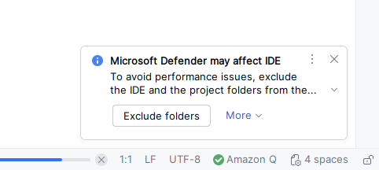

<!--
# Getting Started Guide
# Prepared by @MichaelMcKibbin
# 23 Oct 2025
-->
# Group 5 – Getting Started Guide (IntelliJ Workflow)

Welcome to the Group 5 Software Development Project!

This guide shows you how to **start coding, create branches, and collaborate** using **IntelliJ IDEA’s built-in Git tools** — no command line required.

---

## 1. Prerequisites

These instructions / help files assume that you have installed the following software first:

**IntelliJ IDEA** 2025.2 (Community or Ultimate) https://www.jetbrains.com/idea/download

**Java JDK** 17 or 21

**Git**


To confirm that java and git are installed, you can use a terminal:

Enter the following commands:
```
java -version
git --version
```

---

## 2. Clone the Project
Open IntelliJ.

Choose File → New → **Project from Version Control**...

Paste the repo URL:

https://github.com/MichaelMcKibbin/ATU-SoftDev-Grp5Project.git

Choose a local folder (e.g. C:\Users\<you>\Documents\IntelliJProjects)
and click **Clone**.

If asked, Trust Project.

IntelliJ will automatically detect Maven and load dependencies.


If you have Microsoft Defender installed, you may be prompted to exclude the project folder from scanning.


You might also notice the Maven build success message in the terminal window:


After cloning, you should see something similar to this:
```
csv-data-processor/
│
├─ .idea
├─ .mvn
├─ docs/
│   ├─ team-getting-started.md
│   ├─ pull-request-workflow.md
│   └─ (other documentation files)
├─ src/
│    ├─ main/
│    │   └─ java/
│    │       └─ com/group5/...
│    └─ test/
│        └─ java/
│            └─ com/group5/...
├─ pom.xml
├─ README.md
└─ (other files)
 ```
---
## 3. Check if you’re on the Main Branch
You should see the name of the current branch either on the main (top) toolbar


or in the Git tool window


or you can also check it in the terminal by typing:

```git branch```


**...and now you're ready to code!**

---

**Next Steps...?**


## 4. Create Your Own Feature Branch
Every new piece of work should be done on a feature branch, not main.

Method 1 – GUI (recommended)
Bottom corner → click Git 


Right-click on main and choose + New Branch...


Name it:

e.g. 
```exampleBranch```


or perhaps
```feature/newFeatureExample```


Tick **Checkout branch** → click **Create**.

You are now working on your own new branch.

You can check that you're on the correct branch in the same ways as before.

---
## 5. Make Your Code Changes
Open the files you’re responsible for under ```src/main/java/com/group5/```
and start implementing your feature.

Run tests with:

Right-click → Run ‘All Tests’, or

Maven tab → Lifecycle → test.

---

## 6. Commit Your Work (Save It in Git)
When your feature works locally:

Open the Commit tab (bottom left, or press Ctrl + K).

Select the files you changed.

Write a short, clear message such as:

feat: implement CsvParser FSM core
Click Commit (or Commit and Push).

If you clicked only Commit, do the next step to push it.

---

## 7. Push the Branch to GitHub
Go to Git → Push… (top menu)
or press Ctrl + Shift + K.

Confirm your branch is listed (e.g. feature/parser-fsm).

Click Push.

The branch now appears on GitHub under Branches.

---

## 8. Open a Pull Request (PR)
After pushing, IntelliJ shows a link:

“Open on GitHub”
or
“Create Pull Request”

Click it → GitHub opens in your browser.

Check that it says:

base: main  ←  compare: feature/your-branch

Add:

Title: same as your commit message

Description: what the change does, any notes

Assign one or two reviewers (team members).

Click Create Pull Request.


---

## 9. Code Review & Feedback
Your teammates will:

Read your changes in GitHub’s Files changed tab.

Add comments or suggestions.

Approve the PR when it’s ready.

If someone requests changes:

Return to IntelliJ.

Continue working on the same branch.

Commit and push again — the PR updates automatically.


---

## 10. Merge Your PR (After Approval)

Once:

✅ Reviewers have approved

✅ All GitHub Actions (tests) pass

You’ll see a green Squash and Merge button on GitHub.

Click Squash and merge.

Confirm with a short message, e.g.:

feat: add CsvParser FSM

Click Confirm merge.

Delete the branch when prompted (keeps repo tidy).


---

## 11. Update Your Local Main Branch
Back in IntelliJ:

Bottom-right (or left)  → click Git: feature/... → choose main.

### Git → Pull... → confirm → Pull.

Now your local copy is up to date with the merged code.

(Optional) delete your old branch locally:

### Git → Branches → Delete Branch... → feature/parser-fsm


---

## 12. Repository
👉 https://github.com/MichaelMcKibbin/ATU-SoftDev-Grp5Project


---

## 13. Remember

**Never commit directly to main.**

**Always use a feature branch.**

### Push → Pull Request → Review → Merge → Delete branch.

#### Keep your local main up to date before starting new work.

---
