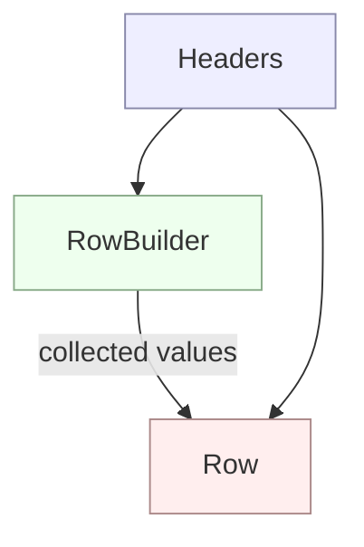

# RowBuilder – Overview

`RowBuilder` is a small, mutable helper class used to safely construct `Row`
instances during CSV parsing. It acts as the bridge between a parser's raw
list of cell values and the final immutable `Row` data model.

## How RowBuilder Works

- The builder is initialised with a `Headers` instance, which defines the
  expected column layout.
- As each CSV row is parsed, the builder collects cell values using:
    - `add(value)` – append next value in order
    - `addAll(values)` – append an entire list
    - `set(index, value)` – set at a specific position
    - `set(name, value)` – set by header name
- Before building, the builder verifies that the collected values match the
  header count.
- Calling `build()` returns an immutable `Row` containing:
    - The same `Headers` instance
    - An ordered, fixed list of values

## Key Points

- Ensures rows always match the header structure.
- Prevents malformed or incomplete rows.
- Keeps `Row` itself simple and immutable.
- Can be reused across rows using `clear()` to reduce allocations.
- Designed for use inside `CsvReader`, but is generally useful for
  programmatic row construction.

---

# How Row, Headers, and RowBuilder Fit Together



# Example Usage

Step 1: Create headers (usually parsed from the first CSV line)
```java
Headers headers = new Headers(List.of("id", "name", "age"));
```

Step 2: Create a builder for these headers
```java
RowBuilder builder = new RowBuilder(headers);
```

Step 3: Add values as the CSV reader parses them
```java
builder.add("1")
       .add("Jim")
       .add("40");
```

Step 4: Build the immutable Row
Row row = builder.build();

Step 5: Access Row data by index or column name
```java
String name = row.get("name");  // "Jim"
int age = Integer.parseInt(row.get("age"));  // 40
```