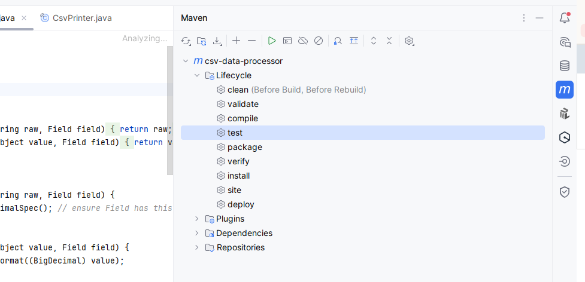
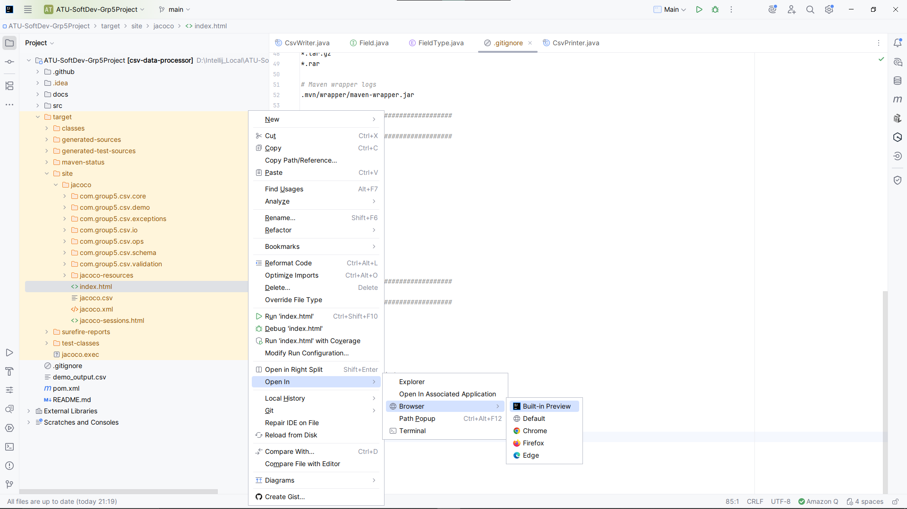
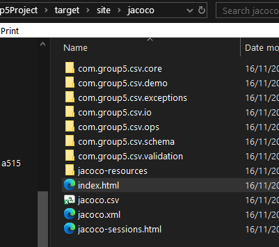
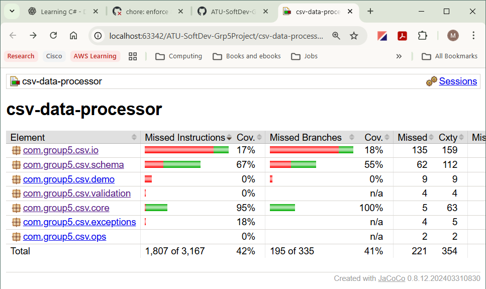
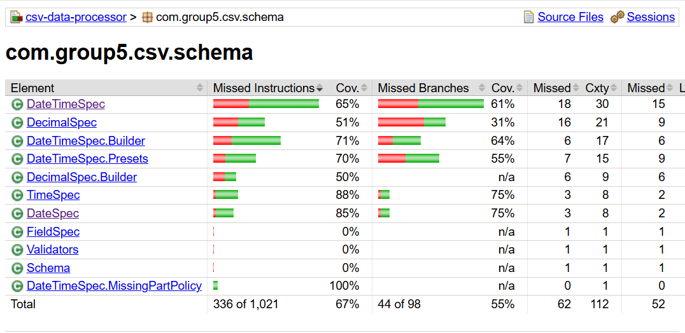
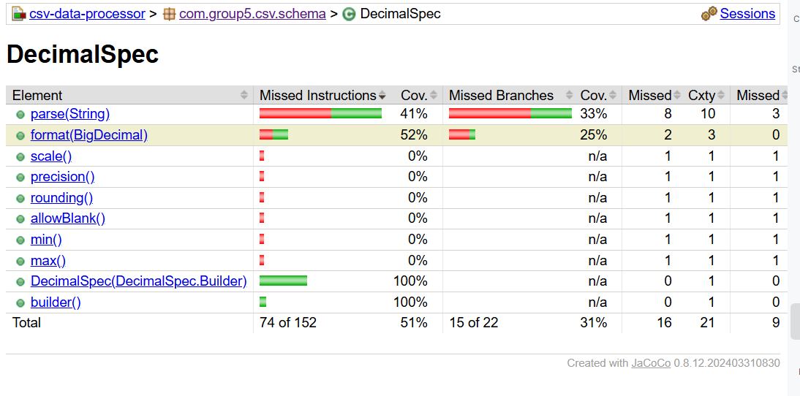
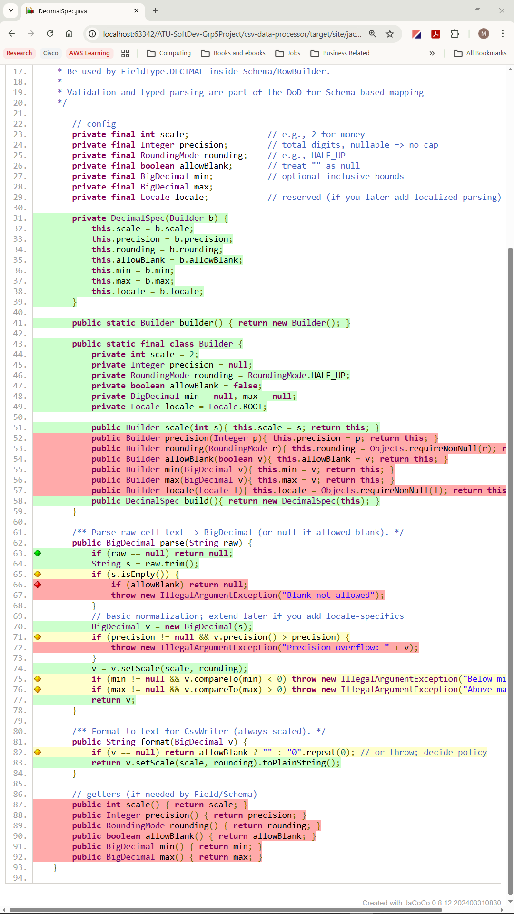

# JaCoCo Reporting in Intellij

This short pictoral guide should help users to run **JaCoCo tests** and find the reports afterwards.

> - **Please ensure you have added JaCoCo to Intellij first**
> - See the [JaCoCo & JUnit Setup Guide](docs/JaCoCo-and-JUnit-setup-readme.md)
> 
> 

---

## 1) Run JaCoCo tests 
In Intellij, 
- Open the Maven Tool Window
- Click **_csv-data-processor_** 
- Click **_Lifecycle_**
- Then, double-click _**test**_

You'll see some output in the run window at the bottom of the screen that will tell you if the tests ran correctly.

---

## 2) Find the JaCoCo report
### 2.1 Intellij
You can choose to view the report in the IDE or in a browser. Right-click on the _index.html_ file and choose **_Open in Browser_**.

### 2.2 Explorer
You can also find the report on your local machine in the Explorer window.

---

## 3) Making use of the report
When you open the index file in your browser, or in the IDE, you'll see a report similar to the one below. Click on the links to drill down through folders and classes to view details about coverage and review code.

